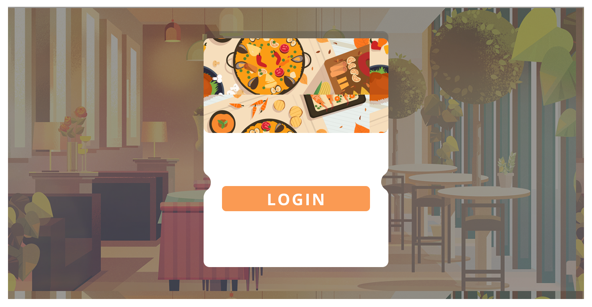
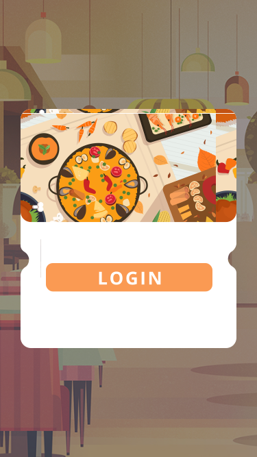

# Croissant 

 

Este é um sistema proposto e desenvolvido durante as aulas da disciplina de Oficina de Integração do curso de Engenharia de Computação da Universidade Tecnológica Federal do Paraná do câmpus de Cornélio Procópio/PR.

 

O sistema é dedicado ao restaurante universitário da faculdade citada anteriormente, com o objetivo de facilitar e agilizar o processo de compra e venda tanto de vales refeições quanto de produtos da lanchonete, além disso, busca-se também a melhoria continua do restaurante.

 

## ﹁ Design ﹂

Como inspiração, foi utilizado as ideias disponíveis no [Dribbble](https://dribbble.com/search/food)

Dessa forma, o design pode ser acessado através do seguinte [link](https://www.figma.com/file/5ZpIuwBRaqEiPgn3JOYKxR/Projeto-de-Oficina-de-Integra%C3%A7%C3%A3o?node-id=42%3A165)

> Nenhuma das imagens utilizadas são autorais, todas foram retiradas do [Unsplash](https://www.google.com/url?sa=t&rct=j&q=&esrc=s&source=web&cd=&cad=rja&uact=8&ved=2ahUKEwiQ-OnDmIj7AhW6BbkGHfATAiIQFnoECAkQAQ&url=https%3A%2F%2Funsplash.com%2F&usg=AOvVaw07uHYdeyZQMneg6p8JTUC3), [Yandex](https://yandex.com/images/) ou do [IsometricLove](https://www.isometriclove.com). Já os ícones, foi utilizado o plugin [Iconify](https://www.figma.com/community/plugin/735098390272716381/Iconify) próprio do Figma.

 

## ﹁ Desenvolvimento ﹂

O sistema web, dedicado aos funcionários do restaurante, apresenta 5 telas diferentes:

1. **Login:** tela de login;
2. **Início:** apresenta o cardápio da semana sendo possível editá-lo;
3. **Vale refeição:** utilizado para consultar disponibildades dos vales;
4. **Lanchonete:** mostra os items da lanchonete, podendo adicionar novos e/ou editar um já existente;
5. **Avaliações:** seção dedicada para consultar as avaliações/sugestões dos usuários do restaurante.
 

Já o mobile, dedicado ao cliente, apresenta 6 telas:

1. **Login:** tela de login;
2. **Início:** é mostrado o cardápio da semana apenas para consulta;
3. **Vale refeição:** é possível verificar a quantidade de vales disponíveis, além do QR Code para poder utilizá-lo e, também, realizar a compra de novos vales refeição;
4. **Lanchonete:** consulta dos produtos disponíves e também realizar a compra de algo;
5. **Histórico:**  mostra o histórico de compras do cliente;
6. **Avaliações:** área dedicada para deixar comentários construtivos acerca do restaurante.
