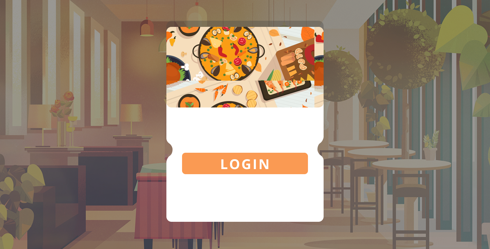

# Croissant

Este é um sistema proposto e desenvolvido na as aulas da disciplina de Oficina de Integração do curso de Engenharia de Computação da Universidade Tecnológica Federal do Paraná do câmpus de Cornélio Procópio/PR.

 

O sistema é dedicado ao restaurante universitário da faculdade citada anteriormente, com o obejtivo de facilitar e agilizar o processo de compra e venda tanto de vales refeições quantos de produtos da lanchonete, além disso, busca-se também a melhoria continua do restaurante.

 

## ﹁ Design ﹂

Como inspiração, foi utilizado as ideia disponíveis no [Dribbble](https://dribbble.com/search/food)

Dessa forma, o design pode ser acessado através do seguinte [link](https://www.figma.com/file/5ZpIuwBRaqEiPgn3JOYKxR/Projeto-de-Oficina-de-Integra%C3%A7%C3%A3o?node-id=42%3A165)

 

## ﹁ Desenvolvimento ﹂

O sistema web, dedicado ao funcionário do restaurante, apresenta 5 telas diferentes:

1. **Login:** tela de login;
2. **Início:** apresenta o cardápio da semana sendo possível editá-lo;
3. **Vale refeição:** utilizado para consultar disponibildades dos vales;
4. **Lanchonete:** mostra os items da lanchonete, podendo adicionar novos e/ou editar um já existente;
5. **Avaliações:** seção dedicada para consultar as avaliações/sugestões dos usuários do restaurante.
 
Já o mobile, dedicado ao cliente, apresenta 6 telas:

1. **Login:** tela de login;
2. **Início:** é mostrado o cardápio da semana apenas para consulta;
3. **Vale refeição:** é possível consultar os vales disponíveis, além do QR Code para pode utilizá-lo e, também, realizar a compra de novos vales refeição;
4. **Lanchonete:** consulta dos produtos disponíves e também realizar a compra de algo;
5. **Histórico:**  o histórico de compras do cliente fica disponível para consulta;
6. **Avaliações:** área dedicada para deixar comentários construtivos acerca do restaurante.
